<div align="center">

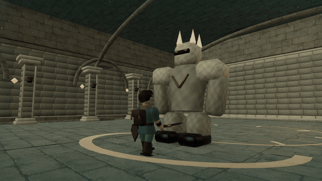

# The Bell of Ages

**A boy, a forgotten song, and a kingdom in two ages: an original 3D action-adventure that runs in your browser.**

[](https://threejs.org/)
[](https://www.typescriptlang.org/)
[](#play-it)
[](https://vite.dev/)
[](docs/BLENDER.md)
[](https://github.com/nearbycoder/Ocarina/releases)

### [▶ Play in your browser](https://nearbycoder.github.io/Ocarina/)

**https://nearbycoder.github.io/Ocarina/**: no install, and nothing to download beyond about 8 MB of game files. It needs a browser with WebGL 2. It plays on a desktop or laptop and on phones and tablets, where on-screen controls appear; see [the browser build](#the-browser-build) for what was tested.

</div>

## Trailer

[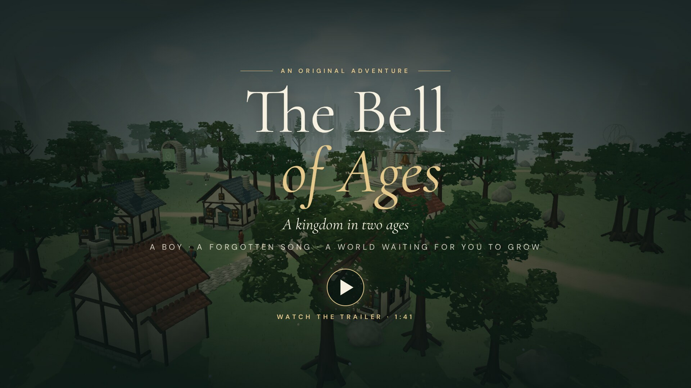](docs/media/trailer.mp4)

<sub>▶ Click the poster to watch the trailer (`docs/media/trailer.mp4`, 1080p30 H.264 and AAC, recorded on 8 October 2026 at the **Ultra** graphics fidelity step). Everything in it is captured from the real game: scripted input drives the normal simulation under a deterministic clock, so every frame is rendered in full however long Ultra takes. The sound effects are the game's own, and the score is arranged from its synthesized flute, chime, and ambient voices. There is no narration.</sub>

## About

Alder is eleven. His father Tomas, the keeper of the great bell, went to mend it last autumn and never came home. On the morning of the lantern festival, the bell sounds its first warning and the village falls quiet.

Take up a practice sword and your father's reed flute. Follow the pale paths out of Alder Village into the Whisperwood, up Cinderpeak, and down to the Larkwater Coast. Solve each sanctuary's trial, break its guardian seal, and face the warden waiting at its heart. Every relic you recover tells you a little more about what happened to Tomas.

When three relics rest in the altar, the Bell of Ages offers a crossing that costs seven years of your life. Make a promise to your oldest friend, step through, and return as an adult to a kingdom that did not wait for you.

The Bell of Ages is an **original adventure inspired by classic 3D action-adventure games**. Its world, characters, story, models, and music are all original to this project. It is a compact prototype campaign with a complete beginning, middle, and ending; see [Status](#status-and-known-issues) for what it is and isn't yet.

Since its first release on 4 October 2026, twelve rounds of improvements have brought gamepad and touch play to parity, made keys and buttons remappable, and added accessibility settings, warden signature attacks and new guardian kinds, distinct sanctuary layouts with hidden alcoves, a lock-on you can see and steer, a compass and map markers, three save slots, and a Graphics fidelity slider from Low to Ultra. Each round's plan, results, and measurements are in [docs/IMPROVEMENTS.md](docs/IMPROVEMENTS.md).

## Play it

**In your browser:** open **[nearbycoder.github.io/Ocarina](https://nearbycoder.github.io/Ocarina/)**. It is the same production build as `npm run build`, so it has every feature below; see [the browser build](#the-browser-build) for the details.

**From source.** The only published release, [v0.1.0](https://github.com/nearbycoder/Ocarina/releases/tag/v0.1.0), is the launch build from 4 October 2026. It predates all twelve improvement rounds, so it has none of the features this README describes as added since (among them the Graphics fidelity slider, remapping, three journeys, and the warden signature attacks). To run the game as it is today on your own machine:

```sh
git clone https://github.com/nearbycoder/Ocarina.git
cd Ocarina
npm install
npm run build && npm run preview   # or: npm run dev
```

Then open the printed address. The build in `dist/` is plain static files with relative asset URLs, so it can be served by any static file server or web host, at the site root or in a subfolder. Browsers block ES modules from `file://`, so opening `index.html` directly will not work.

**The v0.1.0 download.** To try the launch build instead, download **`the-bell-of-ages-web-v0.1.0.zip`** from the release, unzip it, and serve the folder (`npx serve the-bell-of-ages`, or `python3 -m http.server --directory the-bell-of-ages`).

### The browser build

The site at `https://nearbycoder.github.io/Ocarina/` is GitHub Pages serving the `gh-pages` branch, which holds the output of `scripts/build-pages.sh`: the normal production build, plain static files with relative URLs, and no server code or special headers.

- **Download:** about 8 MB in all (the site is 8.7 MB; its largest file is a 2.9 MB surface texture). About 3.3 MB arrives before the title appears (the code, the fonts, and the 2.3 MB model pack, with a progress bar); the two surface textures finish behind the title. GitHub Pages compresses the code further in transit.
- **Tested** on 8 October 2026, served from a local `/Ocarina/` folder, in headless **Chromium 151** and headless **Firefox 157** on Linux (AMD Radeon 8060S). In both, the page reached the title with no console errors (from a local server on a heavily shared machine: 2 to 8 seconds usually, up to 30 at the busiest), a setting change (Graphics fidelity) and a saved journey survived a reload, keyboard play worked, and sound waited for the first click. Safari, Edge, phones, and tablets weren't tested, and headless browsers don't show how it feels to play.
- **If something is missing,** the page says so: without WebGL 2 it asks you to turn on graphics acceleration, and if the game's files fail to load it offers to try again.
- **Phones and tablets:** on a touch screen with no mouse or trackpad, an on-screen thumbstick and **Lock**, **Flute**, **Shield**, **Dodge**, **Use**, and **Sword** buttons appear in play (every one at least 44 points, clear of the notch and the home indicator, several fingers at once); a two-finger pinch moves the camera, and the minimap opens the kingdom map. They hide under menus, the moment a key, mouse, or gamepad is used, and never appear on a desktop; the next touch brings them back. Both orientations work. The page doesn't scroll, zoom, select text, or show long-press menus, every menu works by tap, and sound starts with the first tap. To spare memory, a phone starts on **Low** graphics, and on phones and tablets **Medium** stops at 1.25× resolution; if a visit ends without the page closing (as when a phone closes a tab short of memory), the next one starts a step lower and says so.
- **Tested on phone and tablet profiles** on 9 October 2026 in headless WebKit (iPhone 15 upright and sideways, iPad Pro 11) and headless Chromium (Pixel 7), with real taps and touch events: it reached the title, started play, walked with the thumbstick while swinging with a second finger, held Shield, dodged, locked on, turned the camera by dragging, played the flute, and paused, all by touch. On the Pixel 7 profile, upright and sideways, the page's process peaked at 310 to 330 MB, with a 13 to 37 MB JavaScript heap and 66 MB of WebGL memory, at 34 to 60 frames a second (on a shared machine at a load average of 75 to 100); the iPad profile, on Medium, asks WebGL for about 150 MB. `node tools/mobile/measure.mjs` repeats these runs (see its header). These are emulated devices on a Linux desktop: no real iPhone, iPad, or Android phone has run this build, so iOS's memory limit, real frame rates, heat, and sound on a phone are unconfirmed.
- **What's different from running it yourself:** nothing in the game. The fidelity step starts at **Medium** (**Low** on a phone), as everywhere. Saves and settings stay in this browser for this site, so a journey played on `localhost` doesn't appear here (and the other way round); **Export journey file** and **Import a journey file** move one across. There is no Quit button in any build; close the tab.

To check a served copy: `node tools/check-pages.mjs <url>` exits 0 only when the game reaches its title with no errors; add `--play` for the reload, sound, and play checks, and `--browser firefox` to use an installed Firefox.

**Publishing with Actions instead.** [`.github/workflows/pages.yml`](.github/workflows/pages.yml) can also run the tests and publish `dist/` to Pages. It only runs when started by hand, it has not been run, and it needs Pages set to **GitHub Actions** as the source rather than the `gh-pages` branch.

### System requirements

- A browser with **WebGL 2**: current Chrome, Edge, Firefox, or Safari, on a computer, phone, or tablet. Phones were measured only as emulated devices (see [the browser build](#the-browser-build)).
- A keyboard and mouse, a keyboard alone, a standard-layout gamepad, or a touch screen.
- Graphics: **Low** and **Medium** (the default) are light. On the one machine measured (an AMD Radeon 8060S integrated GPU, at 1280×800), Low to High averaged about 2 to 7 ms a frame and **Ultra** about 15 ms, with slower spikes; Ultra is meant for strong GPUs. See [Status](#status-and-known-issues) for how those numbers were taken.
- Building from source needs **Node.js 22.12 or newer** (Vite 8's minimum) and npm.

## How to play

Play with a keyboard and mouse, a keyboard alone, a gamepad, or touch. The on-screen hints, prompts, and tutorial lines follow whichever you used last, and keyboard keys and gamepad buttons can be changed in **Settings → Keyboard** and **Settings → Gamepad**. **Settings** is on the title screen too, so you can set volume, larger text, reduced motion, and controls before the story begins. **Full screen** is on the title and in the pause menu wherever your browser allows it. Saves are automatic and stay in this browser, which keeps up to three journeys (**Choose a journey** on the title); **Export journey file** in the pause menu keeps a copy you can import in another browser.

Gamepad prompts name the buttons the way your controller prints them: a PlayStation pad shows ✕ ◯ □ △, L1, R1, Create, and Options; a Nintendo pad shows B A Y X, L, R, −, and +; other pads show the Xbox names below. The game tells them apart by the pad's name; **Settings → Gamepad → Button names** can choose one instead. The buttons are the same by position on every pad: the table's **A** is the bottom face button (✕ on PlayStation, B on Nintendo).

| Action                                                                                                                    | Keyboard & mouse                                                                                                                                                                                                                              | Gamepad (standard layout)                          | Touch                                                                |
| ------------------------------------------------------------------------------------------------------------------------- | --------------------------------------------------------------------------------------------------------------------------------------------------------------------------------------------------------------------------------------------- | -------------------------------------------------- | -------------------------------------------------------------------- |
| Move                                                                                                                      | <kbd>W</kbd> <kbd>A</kbd> <kbd>S</kbd> <kbd>D</kbd>                                                                                                                                                                                           | Left stick (analog)                                | Thumbstick (analog)                                                  |
| Look around (with a gamepad or touch the view also trails behind you as you walk; **Settings → Camera → Camera follows**) | Drag the mouse, or arrow keys; or turn on **Settings → Camera → Captured mouse look** (click the scene to capture the pointer, then move the mouse; the left button swings and the right button holds the shield; <kbd>Esc</kbd> releases it) | Right stick                                        | Drag the scene                                                       |
| Camera distance (also **Settings → Camera**)                                                                              | Mouse wheel                                                                                                                                                                                                                                   | Settings                                           | Pinch the scene with two fingers                                     |
| Interact · talk · read · open                                                                                             | <kbd>E</kbd>                                                                                                                                                                                                                                  | **A**                                              | **Use**                                                              |
| Sword (press again mid-swing to chain the combo)                                                                          | <kbd>J</kbd> or click without dragging                                                                                                                                                                                                        | **X**                                              | **Sword**, or tap the scene                                          |
| Shield (guards your front; **Toggle shield** in Settings makes one press raise it and the next lower it)                  | Hold <kbd>Shift</kbd>                                                                                                                                                                                                                         | Hold **RB** or **RT**                              | Hold **Shield**                                                      |
| Dodge roll                                                                                                                | <kbd>Space</kbd>                                                                                                                                                                                                                              | **B**                                              | **Dodge**                                                            |
| Lock on to the nearest enemy (a marker shows which); with none in range, recentre the camera behind Alder                 | <kbd>Q</kbd>; <kbd>←</kbd> <kbd>→</kbd> or a sideways mouse drag switches target                                                                                                                                                              | **LB**; flick the right stick to switch            | **Lock**; swipe the scene sideways to switch                         |
| Reed flute: play low, middle, high                                                                                        | <kbd>F</kbd>, then <kbd>1</kbd> <kbd>2</kbd> <kbd>3</kbd>                                                                                                                                                                                     | **Y**, then **A** **X** **Y**                      | **Flute**, then tap the notes                                        |
| Kingdom map (click a place to set your marker)                                                                            | <kbd>M</kbd>                                                                                                                                                                                                                                  | **Back** (choose a place with the D-pad and **A**) | The minimap, **The Kingdom** button, or the pause menu (tap a place) |
| Journal and equipment                                                                                                     | <kbd>Tab</kbd>                                                                                                                                                                                                                                | D-pad up                                           | Pause menu                                                           |
| Pause, settings, graphics, save                                                                                           | <kbd>Esc</kbd>                                                                                                                                                                                                                                | **Start**                                          | **Ⅱ** button                                                         |
| Return to checkpoint (asks first inside a sanctuary)                                                                      | <kbd>R</kbd>                                                                                                                                                                                                                                  | Pause menu                                         | Pause menu                                                           |
| Advance dialogue                                                                                                          | <kbd>Enter</kbd> or **Continue**                                                                                                                                                                                                              | **A**                                              | **Continue**                                                         |

In menus the keyboard moves with <kbd>↑</kbd> <kbd>↓</kbd> (or <kbd>Tab</kbd>), chooses with <kbd>Enter</kbd> or <kbd>Space</kbd>, and backs out with <kbd>Esc</kbd>; a gamepad moves with the D-pad or left stick, chooses with **A**, and backs out with **B**. A gamepad that can vibrate rumbles briefly when you're hit, guard, land a blow, or a warden's blow lands, and the game pauses if it disconnects or the window loses focus. Touch players can choose a left-handed layout and larger buttons in **Settings → Touch**. Gamepad support was tested with synthetic input in a headless browser, not with physical controllers, and touch with emulated touch events, not on a physical phone or tablet. Golden rings on the ground, edged in dark so they show on sand and snow, warn that an enemy is about to strike: raise your shield or dodge, then hit back while it recovers. Your hearts sit in the top-left corner, where a half heart is drawn as half a heart; at one heart or less they take a warm outline and beat, and the blow that leaves you there sounds a few soft heartbeats.

## Features

### Sword, shield, and the golden ring

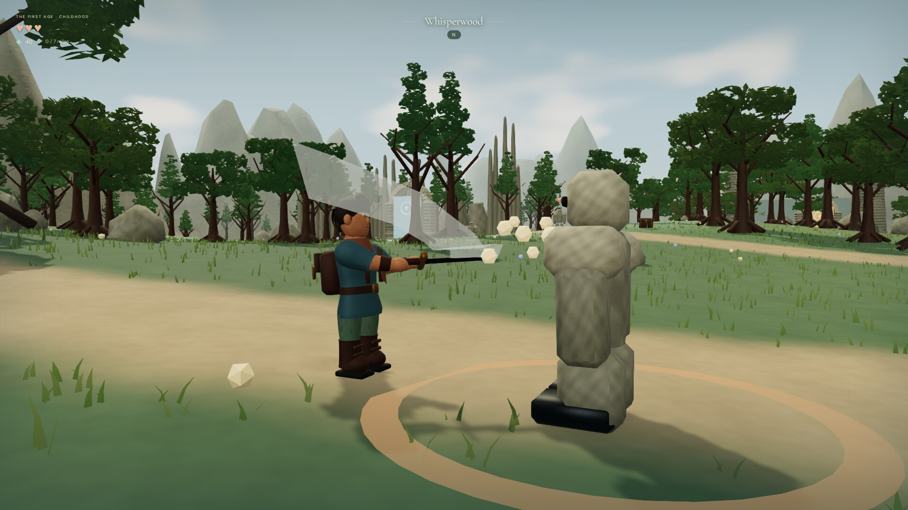

Chain a diagonal cut, a return cut, and a heavier thrust. Damage comes from the blade itself: each swing traces the sword's real path against enemy hit volumes, so a miss is really a miss, and a blade that hits a wall glances off in a shower of sparks. Hits land with a brief hit-stop. Guardians telegraph every attack with a pulsing golden ring, outlined in dark so it reads on pale sand and snow too, and commit to their facing, so a well-timed shield or dodge always has an answer. If one winds up out of view, an orange arrow on the edge of the screen points to it. Guard a blow and the attacker staggers, which gives you a longer opening than a normal recovery. A felled foe topples back and sinks into the ground. Guardians come in three kinds: the classic stone **guardian**; the small, horned **skirmisher**, which closes fast and lunges down a short marked lane; and the tall **warder**, which keeps its distance and lobs a stone at a circle marked where you stand. Face the warder with your shield up, or step out of the circle. The minimap draws guardians as dots, skirmishers as triangles, and warders as diamonds. <kbd>Q</kbd> locks on and keeps a single foe in focus: a gold marker rides over its head (or points from the screen edge when it's out of view), a sideways nudge of the camera switches to the next foe on that side, and when it falls the lock moves to the nearest foe still standing.

### Seven sanctuaries, seven trials

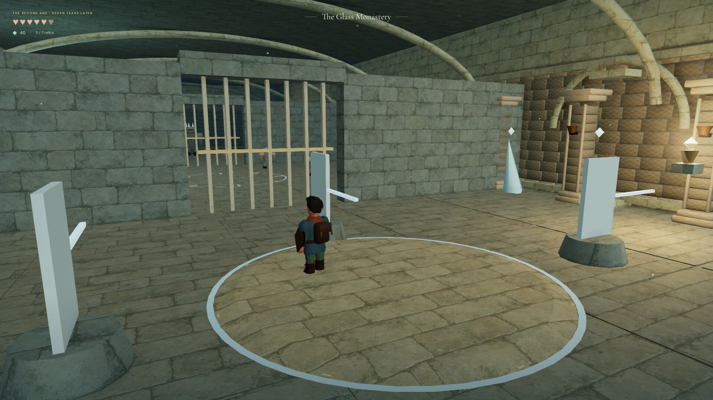

Every sanctuary runs from a puzzle chamber, to a sealed guardian hall, to a warden's arena, and each one asks something different of you: touch memory stones in the order the roots remember, lean into a heavy stone to slide it onto a seal (or push it with the interact button), echo a melody on the reed flute, turn star mirrors until their beams of light point north, balance light and shadow across three flames, and ring bells in the order the inscription names. Each hall and arena is laid out differently, too: root pillars in the Rootbound Hollow, low basalt walls and ember vents in the Ember Vault, fallen shelves and tide pools in the Tidal Archive, glass crystals in the Glass Monastery, sundial obelisks in the Sunken Observatory, rows of sarcophagi in the Moonwell Crypt, and a colonnade in the Silent Crown. Each sanctuary fields its own mix of guardians, and the hall's objective counts how many have fallen. And every guardian hall hides something: one stretch of its side wall is cracked, with seams glowing in the sanctuary's color. Three strong sword blows break it open onto a small alcove and a carving that is copied into your journal.

### Your father's reed flute

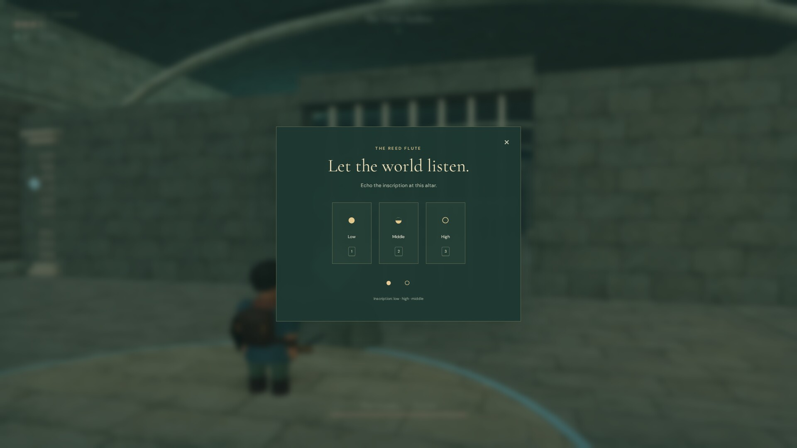

Three notes and a lot of history. Melody altars carve their songs into the stone, and playing them back opens the way. One song in particular will matter more than you expect.

### Wardens worth remembering

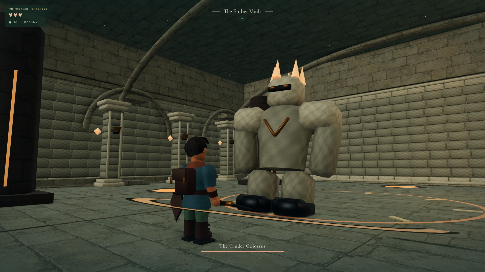

Each sanctuary ends with a towering warden and its own health bar. Every warden slams, and each also has signature attacks with their own warnings on the ground:

- A **charge** marks a lane, then the warden dashes down it. Step out of the lane, or guard to stagger it.
- A **shockwave** shows its full reach, then rolls outward. Be outside the ring, or dodge-roll through the wave.
- A **volley** marks three circles around where you stand, then they erupt. Leave the circles; the shield can't help.

The Briar Warden throws volleys, the Cinder Colossus sends shockwaves, and the Drowned Scribe charges. Each adult warden combines two, and the last uses all three, faster when wounded. Heavy blows shake the camera unless reduced motion is on. Defeat a warden to reveal the sanctuary's relic. The way out by the entrance asks first once you've opened anything, because leaving closes the sanctuary again. Fall in a sanctuary and you wake at the last seal you broke, with its puzzle still solved and its fallen guardians still down. Fall in the wilds and you wake at the nearest place you know: the village, the Bell Sanctuary, or a sanctuary door you've reached.

### A kingdom in two ages

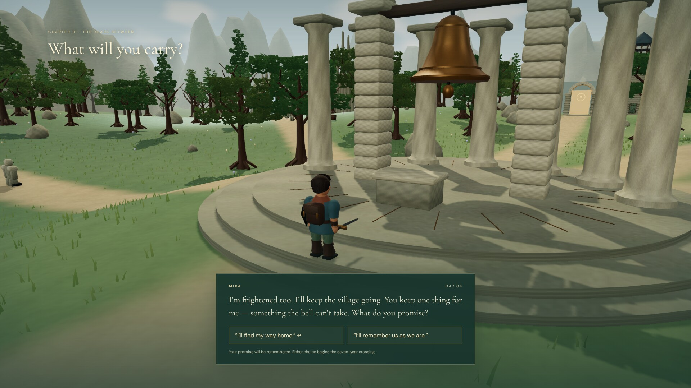

The Bell of Ages carries you seven years forward. Before you go, you make Mira a promise, either "I'll find my way home" or "I'll remember us as we are." Your choice changes your reunion, the memories in your journal, and the ending. As an adult you are taller and stronger and carry the keeper's longsword, the kingdom's light has changed, and three new sanctuaries wake in the far corners of the map.

### A story that remembers

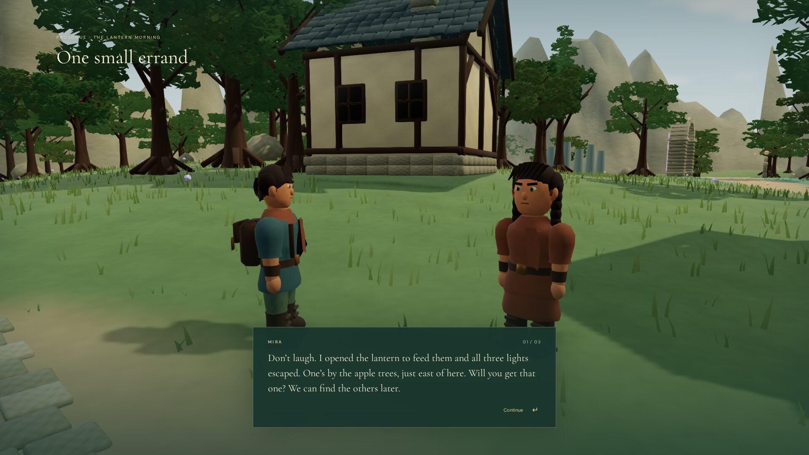

Sixteen story scenes take you from a lantern-morning errand to an ordinary supper at the end of everything. Mira, Soren the smith, and Elder Rowan respond to what you have discovered each time you return. The journal keeps every conversation you've heard, and none you haven't.

### Off the beaten path

Treasure chests hide off the roads; the journal counts them, and the map remembers the ones you've passed. Mira's three wandering lights have slipped away across the kingdom, and bringing them all home earns a heart charm. Soren will forge a star-forged blade for 60 crystals, and the village campfire always has room for a weary traveler.

### A map, a journal, and your place in the world

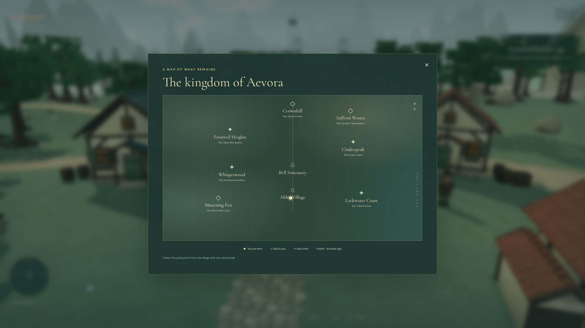

The kingdom map marks every region and sanctuary, fades the ones that belong to another age, and rings your next destination. It also remembers what you've found: chests and wandering lights you've come near appear as hollow marks, filled in once you open or catch them, and a ✎ marks each sanctuary whose hidden carving you've read. Click or tap anywhere on it, or choose a place with a gamepad, to set your own marker. Under the region name, the compass always names where the journey goes next (the nearest sanctuary you can enter, the Bell Sanctuary, or the Silent Crown), or your marker if you've set one. Its arrow points the way (to a sanctuary's door, round the arch if you come at it from behind), and destinations beyond the minimap sit on its rim. Progress autosaves to your browser, including the moment you switch away from the tab or app. **Continue** says which journey it resumes (the age, relics, where you are, and time played) and picks up on the exact line of dialogue you left. Up to three journeys share a browser: **Begin a new story** lets you choose an empty place (or replace a journey, after asking), and **Choose a journey** lists all three with that line. Close the game inside a sanctuary and **Continue** returns you to the start of the furthest chamber you reached, with the seals you broke still open and the guardians you defeated still down. To keep a journey safe or move it to another browser, export it as a small file from the pause menu and import it from the title screen; an imported journey takes the first empty place.

### Graphics fidelity: Low to Ultra

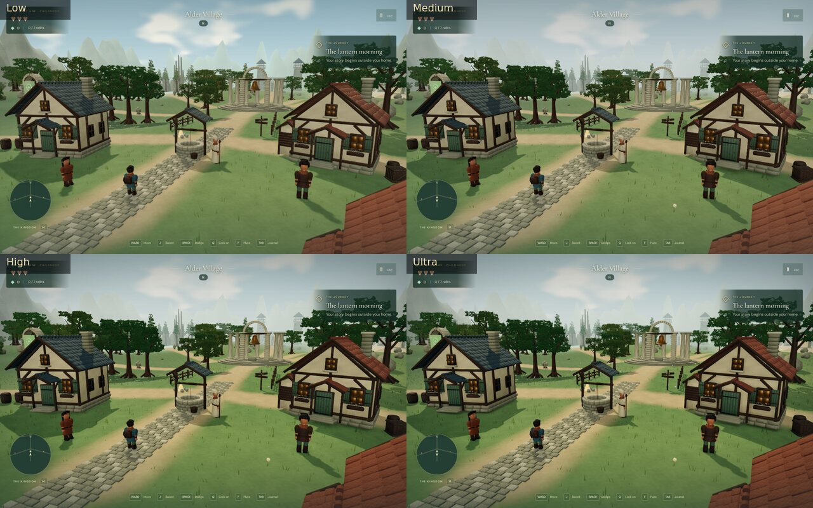

One **Graphics fidelity** slider (Settings → Graphics, or <kbd>Esc</kbd> → Graphics; it can be set from the title too) has four steps. It applies at once and is saved with your other settings. Choose a step with a click or tap, <kbd>←</kbd> <kbd>→</kbd> on the keyboard, or the D-pad or left stick on a pad.

| Step                        | What it draws                                                                                                                                                                                                                                                                                                                                                 |
| --------------------------- | ------------------------------------------------------------------------------------------------------------------------------------------------------------------------------------------------------------------------------------------------------------------------------------------------------------------------------------------------------------- |
| **Low** (default on phones) | For weak graphics: 85% resolution (at most 1×), no post-processing, 1024 shadows, and sparser distant grass.                                                                                                                                                                                                                                                  |
| **Medium** (default)        | Contact shadows and FXAA-smoothed edges, 2048 shadows, up to 1.5× resolution (1.25× on phones and tablets). Under sustained load it lowers the 3D resolution (never the text), then drops post-processing and distant foliage, and restores them when frames recover.                                                                                         |
| **High**                    | A steady resolution up to 1.75×, full grass to 78 m, a soft bloom on bright light, a gentle colour grade, and 4× texture filtering.                                                                                                                                                                                                                           |
| **Ultra**                   | 1.5× supersampling (capped at 2×), SMAA, 4096 shadows with a softer filter redrawn every frame, full-resolution contact shading with twice the samples, 8× texture filtering, grass to 96 m, denser hit sparks, a stronger bloom, and depth of field behind the title and story scenes. Its SMAA and depth of field download only when Ultra is first chosen. |

A Visual quality choice from a build before the slider carries over (Performance → Low, Adaptive → Medium, High detail → High). Ultra is meant for strong GPUs; see [Status](#status-and-known-issues) for measured frame times. The trailer and the screenshots on this page were captured at Ultra.

### Look and feel

The sword leaves a pale, warm arc that fades toward the hilt and its tail, and coloured hit sparks glow amber (on High and Ultra they catch the bloom). Entering or leaving a sanctuary, returning to a checkpoint, a defeat, the age change, and starting or continuing a journey come up from a dark veil over about two thirds of a second instead of cutting, and the loading screen fades into the title. Every button lights on hover, dips when pressed, and shows the same gold focus ring for the keyboard and a pad; moving the focus plays a soft tick on the effects volume, and menus ease in as they open.

### Accessibility and comfort

Everything below is in **Settings**, which opens from the title as well as the pause menu, and is stored apart from your save.

- **Reduced motion** turns off hit-stop pauses, camera shake, the damage flash, the scene-change veil, and sliding interface. It is on by default when your system asks for reduced motion.
- **Larger interface text**, and **off-screen attack warnings** (an arrow on the screen edge points to a foe winding up out of view; on by default).
- **Toggle shield**: one press raises the shield and the next lowers it, instead of holding (a dodge lowers it).
- **Camera:** speed, inverted vertical look, distance (the mouse wheel and a two-finger pinch move it too), **Captured mouse look** (off by default), and **Camera follows** (the view trails behind you as you walk: Automatic, the default, follows with a gamepad or touch but not a keyboard and mouse; or Always, or Never).
- **Sound:** master, effects, ambience, and music volume.
- **Controls:** keyboard bindings for every action except Escape, the camera arrows, and the flute's 1 to 3; gamepad buttons for every play action except Start, which always pauses (menus keep A, B, and the D-pad, and the flute keeps A, X, Y); and button names (Automatic, Xbox, PlayStation, or Nintendo). Where the browser can tell (Chrome and Edge), keys are named as printed on your keyboard, so an AZERTY layout shows ZQSD.
- **Touch** controls come in a left-handed layout and three sizes, show only on touch screens, and keep clear of a phone's notch and home indicator; controller vibration can be turned off.
- Every menu works with the keyboard alone, and **Full screen** is on the title and in the pause menu wherever the browser allows it.

### Input

Keyboard and mouse, a keyboard alone, standard-layout gamepads, and touch can each play the whole campaign. On-screen hints, prompts, and tutorial lines follow whichever you used last; the full table is under [How to play](#how-to-play). Gamepad and touch support were checked with synthetic input in a headless browser, not on physical controllers, phones, or tablets.

## Content overview

Spoiler-light.

|                 | First age · childhood                                                                                           | Second age · seven years later                                                                                                                       |
| --------------- | --------------------------------------------------------------------------------------------------------------- | ---------------------------------------------------------------------------------------------------------------------------------------------------- |
| **Regions**     | Alder Village · The Long Meadow · Bell Sanctuary · Whisperwood · Cinderpeak · Larkwater Coast                   | Frostveil Heights · Saffron Wastes · Mourning Fen · Crownfall                                                                                        |
| **Sanctuaries** | The Rootbound Hollow (memory stones) · The Ember Vault (a stone on the seal) · The Tidal Archive (flute melody) | The Glass Monastery (star mirrors) · The Sunken Observatory (balanced flames) · The Moonwell Crypt (bells in order) · and one more, far to the north |
| **Wardens**     | One per sanctuary, seven in all                                                                                 |                                                                                                                                                      |
| **Relics**      | Three childhood relics open the crossing                                                                        | Three elder echoes open the way to the last sanctuary                                                                                                |

- **10 regions** on one continuous overworld, with field guardians patrolling the wilds.
- **7 sanctuaries**, each with a puzzle chamber, a four-guardian hall, and a warden arena. Every hall and arena has its own layout of cover and obstacles, and every hall hides an alcove behind a cracked wall.
- **16 story scenes**, one meaningful choice, and two variations of the reunion and the ending.
- **Optional:** 6 treasure chests, 3 wandering lights (heart charm reward), 7 hidden carvings, a sword upgrade, and campfire healing.
- **Settings, graphics, accessibility, and input:** see [Features](#graphics-fidelity-low-to-ultra).

## Screenshots

Captured at the Ultra graphics fidelity step on 8 October 2026 (`node tools/media/screenshots.mjs`).

|                                                                                                                        |                                                                                                                         |
| ---------------------------------------------------------------------------------------------------------------------- | ----------------------------------------------------------------------------------------------------------------------- |
| [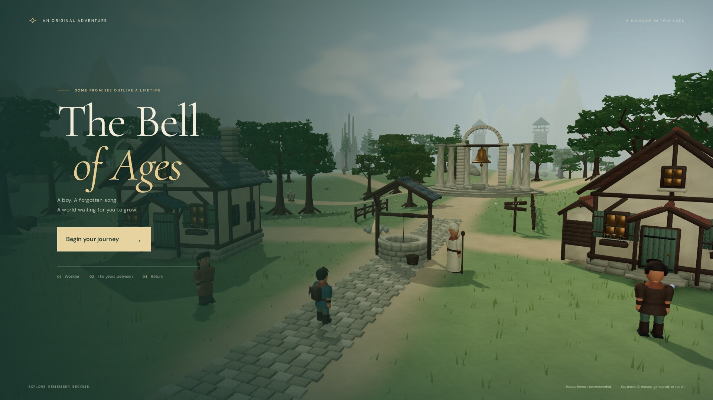](docs/media/screenshots/01-title.jpg)                            | [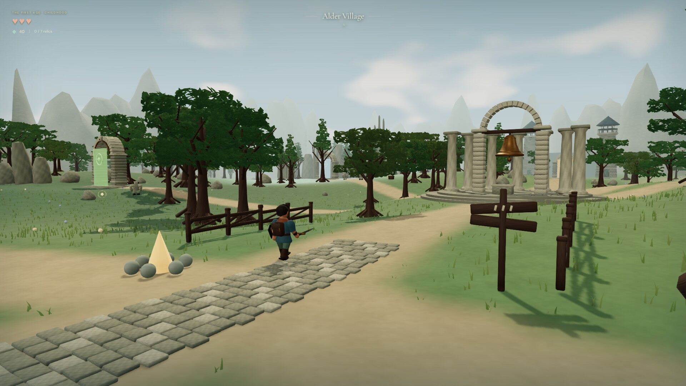](docs/media/screenshots/02-village.jpg) |
| [](docs/media/screenshots/03-story.jpg)                   | [](docs/media/screenshots/04-combat.jpg)         |
| [](docs/media/screenshots/05-boss.jpg)      | [](docs/media/screenshots/06-flute.jpg)      |
| [](docs/media/screenshots/07-mirrors.jpg) | [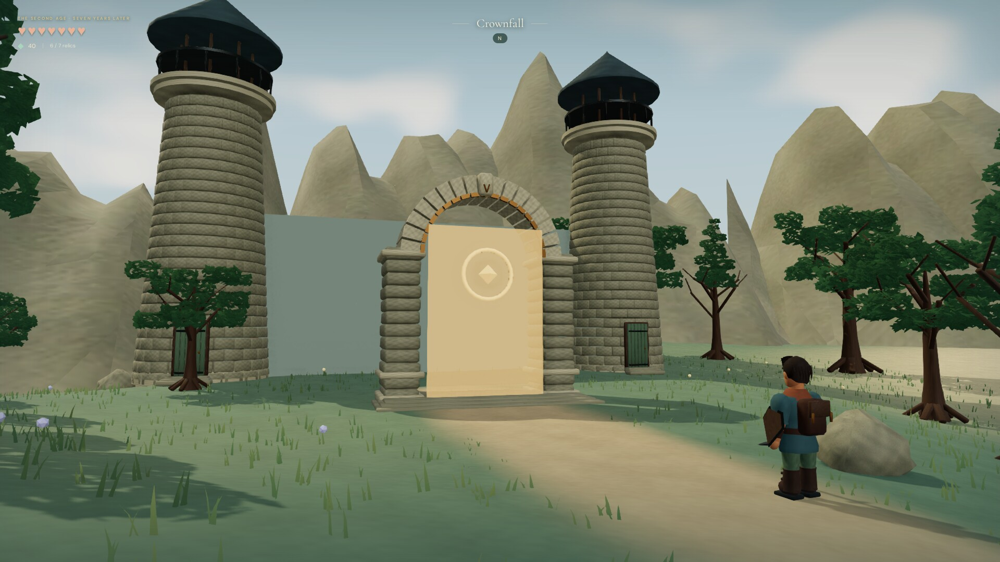](docs/media/screenshots/08-crownfall.jpg)      |
| [](docs/media/screenshots/09-map.jpg)                          | [](docs/media/screenshots/10-promise.jpg)      |

## Build from source

Requirements: **Node.js 22.12+** and npm. You only need [Blender 4.5 LTS](https://www.blender.org/) to regenerate the 3D models; the compressed model pack is already committed.

```sh
npm install
npm run dev        # http://localhost:5174 (dev build with debug helpers)
npm test           # 155 Vitest tests: progression, region names, story, saves, hearts, sanctuary visits, journey files, checkpoints, settings, key and pad bindings, rumble, input, lock-on, the following camera, Alder's fade, wayfinding and sanctuary doors, map finds, foes, warning outlines, falling foes, layouts, alcoves, audio, sparks, assets, collision, combat, graphics fidelity
npm run build      # type-check + production build into dist/
npm run preview    # serve the production build
scripts/build-pages.sh                  # the GitHub Pages site, into pages-dist/
node tools/check-pages.mjs <url> --play # check a served copy (see "The browser build")
```

If you reach the dev server through another hostname, list it in `BELL_ALLOWED_HOSTS` (comma-separated).

**3D assets.** All 31 models (cottages, sanctuary, dungeon kit, props, trees, characters, and the warden) are generated by a deterministic Blender Python script, along with their procedural texture atlas. The script writes the editable `art/blender/alder-library.blend`, then glTF Transform compresses the export with Meshopt and WebP and validates it:

```sh
npm run assets:build   # Blender (headless) → glTF → Meshopt/WebP → validation
npm run assets:check   # validate public/models/alder-kit.optimized.glb only
```

See [docs/BLENDER.md](docs/BLENDER.md) for the asset contract, budgets, and review scenes.

**Audio.** There are no audio files. Everything is synthesized at runtime with the Web Audio API in [`src/audio.ts`](src/audio.ts): flute notes, chimes, and combat sounds; footsteps that change with the surface (stone, path, grass, sand, snow); ambient beds per region (birdsong in the Whisperwood, surf on the coast, wind over Cinderpeak and the Saffron Wastes, glassy chimes in Frostveil, drips in the Fen and the sanctuaries); a drum pulse during warden fights; a soft heartbeat when a blow leaves you at one heart; and soft UI and crystal pickup sounds. The browser checks confirm these voices are scheduled when they should be. Nobody has listened to the mix yet (including the low-health heartbeat), so its balance is untested.

**Browser checks.** `tests/browser-checks.js`, `tests/polish-checks.js`, `tests/settings-checks.js`, `tests/input-checks.js`, `tests/foe-checks.js`, `tests/puzzle-checks.js`, `tests/lockon-checks.js`, `tests/map-checks.js`, `tests/wayfinding-checks.js`, `tests/camera-checks.js`, and `tests/rumble-checks.js` hold scripted campaign, checkpoint, movement, combat, enemy, warning-outline, falling-foe, layout, hidden-alcove, puzzle, audio, settings, key-remapping, gamepad, gamepad-remapping, lock-on, off-screen-warning, map-discovery (including a flood fill to every chest and wandering light), compass, sanctuary-door, home-region, map-marker, camera, following-camera, fading-hero, leaving-a-sanctuary, rumble, and pause assertions for a dev-server page opened at `/?review=polish`. With the dev server running, `node tests/run-browser-checks.mjs` runs all of them in headless Chromium, plus journey-file export and import through real downloads and file pickers, a real mouse drag that switches lock-on targets, a real click on the map and a real mouse wheel, and touch checks on phone-sized pages, including a two-finger pinch and an overlap check of every touch layout with the prompt, warden bar, and toast showing. In fresh, throwaway browser contexts on the normal URL it checks saving when the page is hidden or closed and resuming a sanctuary after a reload. It walks by key presses alone, steering at the compass arrow, from the village to every sanctuary door, and plays the opening from the title with real clicks and key presses only, through the first sanctuary's door. It also checks the hearts (a half heart's pixels, the low-health warning, and the heartbeat after a real guardian strike), the guardian hall's count through a defeat, and the pause menu's fit at nine laptop and desktop sizes. It loses and restores the WebGL context and compares the picture, and checks the title's fit at seven desktop sizes (set `BELL_URL` if the server isn't on port 5174).

**Performance sampler.** `node tools/perf/sample.mjs [label] [out.json]` samples frame times, draw calls, and live geometries in real time in three scenes (village, Whisperwood, a guardian-hall fight), with vsync off. `BELL_PERF_VIEWPORT=1920x1080@2` and `BELL_PERF_QUALITY=medium` (low, medium, high, or ultra) change the window and fidelity step. `node tools/media/round12.mjs shots` and `perf` compare all four steps in the same frame. It records the machine's load average next to the numbers, because they only mean something on a quiet machine. See [docs/POLISH.md](docs/POLISH.md) and [docs/VALIDATION.md](docs/VALIDATION.md).

**Trailer and screenshots.** Everything under `docs/media/` is reproducible. With the dev server running:

```sh
npx playwright install chromium         # once
node tools/media/screenshots.mjs        # docs/media/screenshots/*.jpg
node tools/media/trailer.mjs all        # capture beats → render score → assemble docs/media/trailer.mp4
node tools/media/teaser.mjs             # poster frame + docs/media/teaser.gif
```

The capture harness runs the game under Playwright's fake clock, so every frame advances the simulation by exactly 1/30 s however long rendering takes. That is why it can record at **Ultra** (the default; set `BELL_FIDELITY` to `low`, `medium`, or `high` for another step) without dropping frames, as an offline render would. It records the game's own Web Audio output through an `OfflineAudioContext` and stages each beat through the dev-only debug API, clearing the scene-change veil at its own cuts. `node tools/media/trailer.mjs capture <beat> --preview` writes a contact sheet of one beat to `.capture/preview/`. Set `BELL_URL` if the dev server isn't on port 5174. ffmpeg and ImageMagick are required.

## Project structure

```
src/
  main.ts           boot + asset loading screen
  game.ts           simulation, input, camera, combat flow, dungeons, rendering loop
  data.ts           save format, campaign rules, sanctuaries, regions
  story.ts          16 story scenes, quest stages, NPC reflections, journal
  combat.ts         attack timing, poses, blade/capsule geometry
  physics.ts        spatially indexed swept-circle collision
  world.ts          overworld + dungeon construction, interactables
  terrain.ts        deterministic height and biome function
  nature.ts         instanced vegetation, LOD and culling
  architecture.ts   procedural architectural detail
  atmosphere.ts     sky dome, graphics fidelity steps, adaptive resolution
  rendering.ts      post-processing (contact shadows, bloom, colour grade, FXAA/SMAA, depth of field)
  surfaces.ts       custom surface shaders (wind, water, terrain)
  assets.ts         glTF/Meshopt loading, instancing-safe geometry
  audio.ts          Web Audio synthesis: effects, footsteps, ambient beds, warden drums
  sparks.ts         pooled, instanced hit sparks
  lockon.ts         lock-on target choice, screen-edge anchoring, shortest turns
  wayfinding.ts     compass destinations, bearings, minimap rim, map marker
  foes.ts           warden attacks, guardian kinds, attack geometry
  layouts.ts        authored sanctuary halls, arenas, guardian formations, hidden alcoves
  input.ts          gamepad mapping, key bindings, stick shaping, rumble, device-aware control text
  settings.ts       validated player settings (volume, camera, comfort)
  ui.ts             HUD, dialogue, map, journal, menus, settings
tests/              Vitest suites + in-browser check scripts
scripts/            Blender asset build, compression, validation; build-pages.sh
art/blender/        editable .blend source library
public/             compressed model pack + two painted textures
tools/media/        screenshot + trailer capture, score, assembly
tools/perf/         real-time frame sampler
tools/balance/      scripted-fighter measurements of every hall and arena
tools/check-pages.mjs  check a served web build (title, reloads, sound, play)
docs/               design notes, validation records, media
```

## Tech highlights

- **One height function.** Terrain rendering, character grounding, and camera clearance all sample the same deterministic function, so nothing floats or sinks.
- **Swept collision.** Movement and dodges are swept circles against rotated boxes and trunk circles in a spatial hash. Fast rolls can't tunnel through fences, and you slide along walls instead of sticking. Gates and the push-block update their colliders live.
- **Blade-accurate combat.** The sword's base-to-tip segment is sampled at 120 Hz across each swing's active window and tested against enemy capsules, so hits that fall between frames still count. Scenery deflects the blade with recoil. Hit-stop, committed enemy wind-ups, and frontal-only shielding make timing readable.
- **Camera that respects walls.** The follow camera casts against obstacle heights, retracts immediately, eases back out, and re-casts its interpolated position so smoothing can't clip through a corner. When a wall pulls it in close, Alder fades (each part writes its depth first, so only his outer surface shows) and the way ahead stays in view.
- **A scripted Blender pipeline.** 31 models with shared physical materials are authored in a Blender Python script, exported to glTF, then compressed with Meshopt and WebP by glTF Transform, from 13.3 MB down to a 2.4 MB runtime pack that passes the Khronos validator with zero errors. Quantized positions are decoded before instancing transforms are baked.
- **Rendering on a budget.** Static scenery is batched by material and spatial cell. Vegetation is instanced, wind-animated in the shader, culled per cell, and swapped to lighter LODs at distance. A Graphics fidelity slider runs from Low (no post-processing) through Medium (half-resolution GTAO contact shadows and FXAA, lowering 3D resolution, never UI sharpness, under sustained load) and High (a thresholded bloom and a colour grade) to Ultra (supersampling, SMAA, 4096 shadows every frame, full-resolution contact shading, depth of field); Ultra's extra passes load only when it's chosen. Hit sparks come from one fixed instanced pool, so combat allocates no geometry.
- **Durable saves.** Saves are validated field by field on load. Older saves migrate forward without losing progress, the pending story line is stored so a reload resumes mid-conversation, and an unfinished sanctuary visit is stored so a reload resumes at its furthest chamber.
- **Graphics that come back.** If the device takes the WebGL context away, the game saves, pauses, and says so. When the context returns it rebuilds the lighting environment and shadows that were rendered once. Sound is suspended while the page is hidden and resumes on the next input.
- **No audio files.** Every sound, from flute notes to sword swings, is synthesized with oscillators and filtered noise.

## Credits and tooling

Design, code, story, Blender models, and audio synthesis: **[nearbycoder](https://github.com/nearbycoder)**, developed with AI coding assistants. The architecture and inspection approach follow OpenAI's [Building games with Astra](https://developers.openai.com/blog/how-to-build-games-with-astra) guide.

| Asset or tool                                                                                                                       | License / source                                                                                                                  |
| ----------------------------------------------------------------------------------------------------------------------------------- | --------------------------------------------------------------------------------------------------------------------------------- |
| [three.js](https://threejs.org/) r186 and its addons                                                                                | MIT (bundled; see [THIRD_PARTY_NOTICES.md](THIRD_PARTY_NOTICES.md))                                                               |
| [meshoptimizer](https://github.com/zeux/meshoptimizer) decoder                                                                      | MIT (bundled)                                                                                                                     |
| [Cormorant Garamond](https://fonts.google.com/specimen/Cormorant+Garamond) and [DM Sans](https://fonts.google.com/specimen/DM+Sans) | SIL OFL 1.1, bundled as Latin woff2 subsets via [Fontsource](https://fontsource.org/); license in `public/licenses/fonts-OFL.txt` |
| 31 Blender models + procedural texture atlas                                                                                        | Original, generated by [`scripts/build_assets.py`](scripts/build_assets.py)                                                       |
| Limestone and alder-foliage textures (`public/textures/`)                                                                           | Original, created with an AI image-generation tool for this project; prompts are recorded in [docs/VISUALS.md](docs/VISUALS.md)   |
| Sound effects, ambient music, trailer score                                                                                         | Original, synthesized with the Web Audio API                                                                                      |
| Build and test tooling                                                                                                              | Vite, Vitest, TypeScript, glTF Transform, gltf-validator, sharp, Prettier, Playwright, Blender 4.5 LTS, ffmpeg, ImageMagick       |

## Status and known issues

The Bell of Ages is a **playable prototype** (v0.1.0) with a complete story from the opening to the epilogue. It is not a finished commercial game. Honestly:

- **The release is behind the code.** The v0.1.0 download is the launch build of 4 October 2026; the twelve improvement rounds since are on `main` and in the [browser build](#the-browser-build), not in a release download (see [Play it](#play-it)).

- **Short dungeons on one spine.** All seven sanctuaries still follow the same three chambers in a straight line: puzzle, guardian hall, then warden arena. Halls and arenas have their own cover, obstacles, and guardian mix, the wardens fight differently, and each hall now hides one optional alcove behind a cracked wall. There are still no keys, shortcuts, or rooms you must choose between. A full playthrough is short.
- **One enemy model.** All three guardian kinds and all seven wardens use a single Blender model, reshaped with scale, accessories, and tint. Behavior differs (melee, lunge, thrown stone, and the wardens' signature attacks), but none has unique sculpted art or animation, and health and damage stay on one scale.
- **Rigid characters.** Characters are articulated rigid meshes with procedural animation, with no skinned deformation, facial animation, or voice acting. Story scenes are text.
- **No swimming, climbing, or ranged tools.** Traversal is walking and dodge-rolling.
- **Combat is forgiving.** A scripted fighter that never guards or dodges finished every guardian hall and warden arena, and lost only the first fight with the practice sword. Careful play lost at most 1.5 hearts per sanctuary, and no arena took longer than 22 seconds. Of the wardens' signature attacks, only the shockwave landed at all. Health and damage are unchanged until the owner decides the difficulty direction; the measurements are in [docs/IMPROVEMENTS.md](docs/IMPROVEMENTS.md#the-fights-measured-item-e).
- **Input coverage.** Keyboard and mouse, a keyboard alone (every menu included), standard-layout gamepads, and touch can each play the whole campaign. Gamepad and touch support were verified with synthetic gamepad input and emulated touch in headless Chromium, not on physical controllers, phones, or tablets. Keyboard keys and gamepad buttons can be remapped. Touch controls can be mirrored for the left hand and made larger, but individual buttons can't be moved. Gamepad vibration was checked by recording the effects a synthetic pad was asked to play, so how it feels on a real controller is untested. Button names follow the pad's reported name (PlayStation and Nintendo pads by vendor), checked with synthetic pads named like a DualSense, a Switch Pro Controller, and an Xbox pad; a pad that reports an unusual name gets the Xbox names, and Settings can choose the family. A PlayStation 4 pad's Share button is shown as Create, its name on a PlayStation 5 pad. Captured mouse look is off by default; its pointer capture and button presses were checked with real clicks in headless Chromium, but the mouse movement was synthetic. Camera follows (on by default with a gamepad or touch) was checked with a synthetic gamepad and key presses; how it feels in the hand is untested. Importing a journey file, and going full screen, may need a mouse, keyboard, or touch: browsers allow a file picker or full screen only after a click, key press, or tap, so they may not open from a gamepad button. Full screen isn't offered where the browser can't do it (an iPhone's Safari).
- **Hardware.** Requires WebGL 2. On an AMD Radeon 8060S iGPU in headless Chromium (vsync off, on a heavily shared machine at a load average of 23 to 40), a 1280×800 window averaged about 2 to 7 ms a frame on Low, Medium (the default), and High in real-time play, and about 15 ms on Ultra (with slow frames: p95 32 to 41 ms). In staged views at 1920×1080, Low to High took 2 to 6 ms and Ultra 15 to 20 ms. Ultra supersamples and redraws 4096 shadows every frame, so it is meant for strong GPUs; Low stays as light as the old Performance mode. Phones and tablets were measured only as emulated devices in headless WebKit and Chromium (see [the browser build](#the-browser-build)); other GPUs and real phones haven't been measured. Full numbers are in [docs/IMPROVEMENTS.md](docs/IMPROVEMENTS.md#the-fidelity-steps-measured).
- **Saves are per browser.** They live in `localStorage`, up to three journeys, and clearing site data removes them all, unless you've exported a journey file to import again. Older builds see only the first journey. The game saves when you switch away from the tab or app; that was checked with a simulated hidden page, not on a phone. Inside a sanctuary the save keeps what the visit opened, and a reload returns to the furthest chamber; a half-solved puzzle starts over, as it does after a defeat.
- **Lost graphics.** Recovery from a lost WebGL context was checked with the browser's `WEBGL_lose_context` extension, not a real phone or GPU reset. Whether a phone's browser restores the context or discards the tab instead is untested; in either case the journey is saved first.
- **Validation.** Automated tests and scripted browser checks cover progression, checkpoints, collision, combat, warden and guardian attacks, sanctuary reachability, hidden alcoves, puzzles, audio scheduling, settings, key and gamepad remapping, lock-on, off-screen warnings, map discoveries and chest reachability, the compass and map marker, the camera, gamepad rumble and pausing, journey files, keyboard-only menus, settings from the title, full screen, saving when the page is hidden, resuming a sanctuary after a reload, three journeys on one device, controller button names, captured mouse look, the hearts and the low-health warning, the guardian hall's count, outlined warning rings, falling foes, the following camera, Alder fading when a wall pushes the camera close, the question before leaving a sanctuary, the compass leading to every sanctuary door with key presses alone, the opening played from the title with input alone, the Graphics fidelity slider (each step reaching the renderer, by keys, mouse, and pad, kept after a reload, and an older build's choice carried over), the sword trail's fade, the veil over scene changes, menu feedback (the focus tick, pressed, hover, and focus states), the settings sheet's fit at nine window sizes, the village's region name, the pause menu's fit on laptop screens, a lost and restored graphics context, sound suspended and resumed, the title's fit with a saved journey, gamepad input, and touch input and layouts (including the prompt, warden bar, and notices). A scripted fighter measures every hall and arena (`tools/balance/measure.mjs`). Apart from the opening and the walks between sanctuary doors, which use input alone, the checks still stage their scenes with the debug tools; a full playthrough of every encounter with real input, and pacing tuning, are still outstanding. See [docs/VALIDATION.md](docs/VALIDATION.md).

Production notes and next steps live in [docs/CAMPAIGN.md](docs/CAMPAIGN.md), [docs/STORY.md](docs/STORY.md) (spoilers), [docs/VISUALS.md](docs/VISUALS.md), and [docs/POLISH.md](docs/POLISH.md).

## License

No license has been chosen yet. Until one is added, all rights are reserved by the author. Bundled third-party components keep their own licenses (see [THIRD_PARTY_NOTICES.md](THIRD_PARTY_NOTICES.md)).
